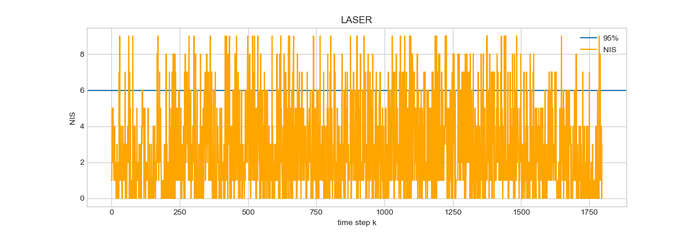
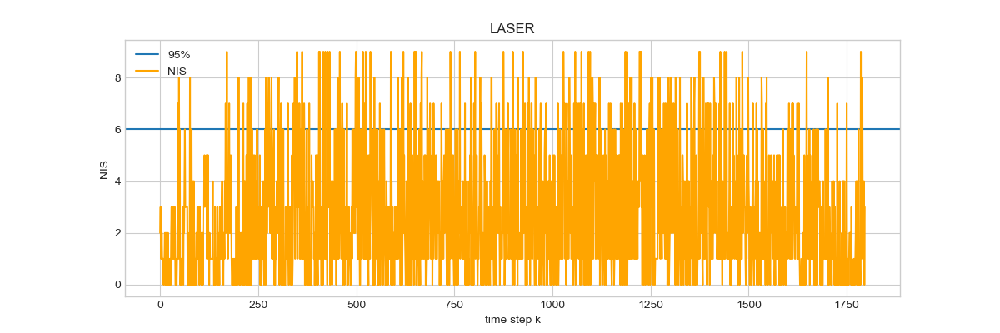
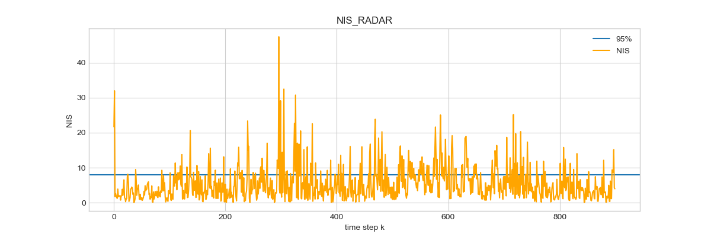
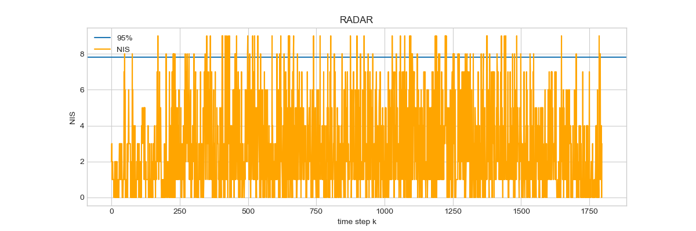
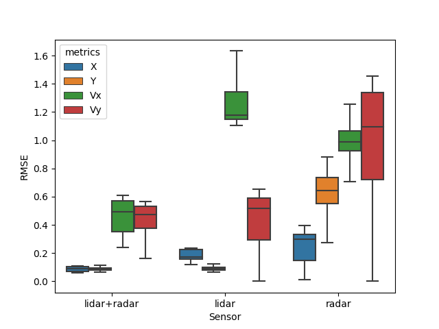

# SFND_Unscented_Kalman_Filter
Sensor Fusion UKF Highway Project Starter Code

In this project you will implement an Unscented Kalman Filter to estimate the state of multiple cars on a highway using noisy lidar and radar measurements. Passing the project requires obtaining RMSE values that are lower that the tolerance outlined in the project rubric. 

The main program can be built and ran by doing the following from the project top directory.

1. mkdir build
2. cd build
3. cmake ..
4. make
5. ./ukf_highway

---

## Other Important Dependencies
* cmake >= 3.5
  * All OSes: [click here for installation instructions](https://cmake.org/install/)
* make >= 4.1 (Linux, Mac), 3.81 (Windows)
  * Linux: make is installed by default on most Linux distros
  * Mac: [install Xcode command line tools to get make](https://developer.apple.com/xcode/features/)
  * Windows: [Click here for installation instructions](http://gnuwin32.sourceforge.net/packages/make.htm)
* gcc/g++ >= 5.4
  * Linux: gcc / g++ is installed by default on most Linux distros
  * Mac: same deal as make - [install Xcode command line tools](https://developer.apple.com/xcode/features/)
  * Windows: recommend using [MinGW](http://www.mingw.org/)
 * PCL 1.2

## Basic Build Instructions

1. Clone this repo.
2. Make a build directory: `mkdir build && cd build`
3. Compile: `cmake .. && make`
4. Run it: `./ukf_highway`

## Project Requiremtns

* UKF has been implemented following the templates provided in Udacity Sensor Fusion Github repository.
* Project compiled without error using cmake and make.
* RMSE for all the 4 metrics mentioned in the rubric remains 
within required threshold of px, py, vx, vy RMSE <= [0.30, 0.16, 0.95, 0.70] 
after running for longer than 1 second. One can verify by running my program.
* My solution follows the algorithm as described in the preceding lesson.
* Several relevant output logs and charts can be found in logs directory

## Normalized Innovation Squared (NIS)

Normalized Innovation Squared (NIS) values has been calculated and ploted with different initialization
of process covariance matrix P. Initially identiy matrix has been used which performed poorly later fine
tuned parameters were used to improve the NIS consistency. Following figure shows NIS for before and after fine
tuning P parameters.

Lidar NIS before fine tuning P:

Lidar NIS after fine tuning P:

Radar NIS before fine tuning P:

Radar NIS after fine tuning P:

## Effect of using only Lidar, Radar and both

Follwing figure compares the effect of using single sensor and multiple sensor using sensor fusion
using UKF based on the metrics of positional and velocity accuracy estimation. The root mean squared error
shows that sensor fusion using UKF is more accurate. It also shows Lidar is more accurate in position
estimation where radar is useful for velocity. For better visibility outliers have been removed from the
plot. However, Lidar have more outliers inv velocity estimation in accuracy calculation than radar 
indicating the fact that it is less reliable predicting velocity.  

 

